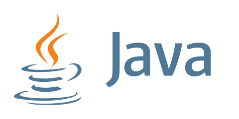
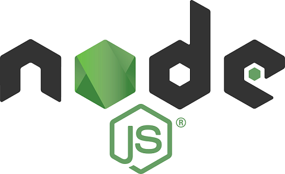

Casbin is a powerful and efficient open-source access control library. It provides support for enforcing authorization based on various access control models.

## All the languages supported by Casbin:

 |  |  | 
----|----|----|----
[Casbin](https://github.com/casbin/casbin) | [jCasbin](https://github.com/casbin/jcasbin) | [node-casbin](https://github.com/casbin/node-casbin) | [PHP-Casbin](https://github.com/php-casbin/php-casbin)
production-ready | production-ready | production-ready | experimental

## Features

What Casbin does:

1. enforce the policy in the classic ``{subject, object, action}`` form or a customized form as you defined, both allow and deny authorizations are supported.
2. handle the storage of the access control model and its policy.
3. manage the role-user mappings and role-role mappings (aka role hierarchy in RBAC).
4. support built-in superuser like ``root`` or ``administrator``. A superuser can do anything without explict permissions.
5. multiple built-in operators to support the rule matching. For example, ``keyMatch`` can map a resource key ``/foo/bar`` to the pattern ``/foo*``.

What Casbin does NOT do:

1. authentication (aka verify ``username`` and ``password`` when a user logs in)
2. manage the list of users or roles. I believe it's more convenient for the project itself to manage these entities. Users usually have their passwords, and Casbin is not designed as a password container. However, Casbin stores the user-role mapping for the RBAC scenario.
